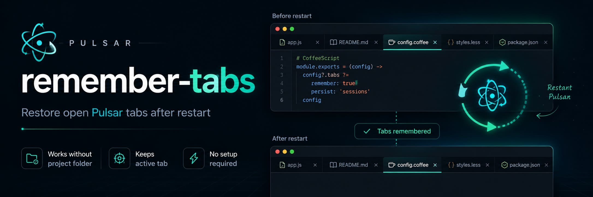

[![Badge Version]][Releases]  
[![Badge License]][License]



# Remember Tabs for Pulsar

Remember open file tabs in [Pulsar](https://pulsar-edit.dev/) and restore them after the editor restarts.

`remember-tabs` is a small Pulsar package for keeping your open file tabs between sessions. It works even when you are not using a project folder: if you opened files directly by path, the package records those paths and reopens them the next time Pulsar starts.

## Features

- Restores open file tabs after Pulsar restart or window reload.
- Works without an open project folder.
- Keeps the previously active tab active after restore.
- Avoids reopening duplicate tabs that are already open.
- Runs automatically on startup; no command or setup is required.

## How it works?

The package watches Pulsar workspace tab changes and stores the absolute paths of open file tabs in Pulsar config. On the next startup, it reads the saved list and reopens every existing file path.

Only tabs backed by real files on disk are saved. Untitled editors and unsaved text buffers are not restored.

## Installation

Place this package in your Pulsar packages directory:

```sh
~/.pulsar/packages/remember-tabs
```

Then reload Pulsar or restart the editor.

## Usage

Open files as usual. The package works in the background.

When Pulsar restarts, your previously open file tabs are restored automatically.

## Development

Run the package specs from this directory:

```sh
Pulsar.exe --test spec --no-sandbox
```

On systems where `pulsar` is available in `PATH`, this may also work:

```sh
pulsar --test spec
```

## Limitations

- Unsaved untitled editors are not restored.
- Deleted, moved, or inaccessible files are skipped.
- Non-file tabs, settings pages, and package-provided custom views are ignored.

## Author

enes sönmez <root{@}enes.dev>
- https://enes.dev
- https://x.com/enes_dev

## License

MIT

[Badge Version]: https://img.shields.io/badge/version-1.0.0-blue.svg
[Badge License]: https://img.shields.io/badge/license-MIT-green.svg
[Releases]: ../../releases
[License]: LICENSE.md
